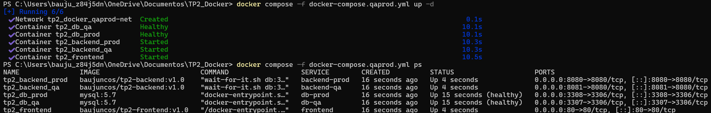
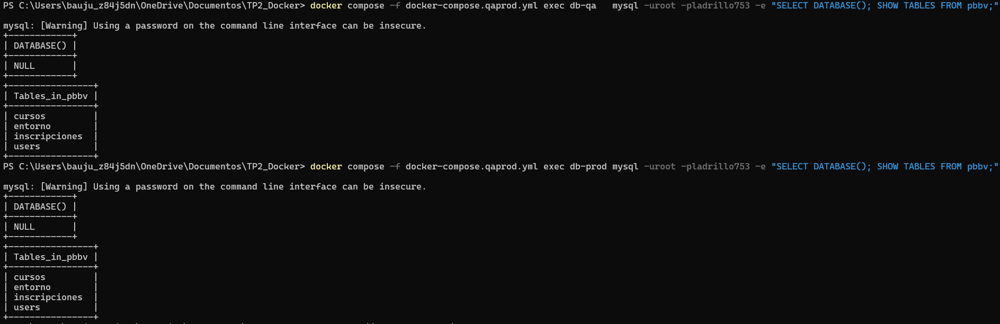
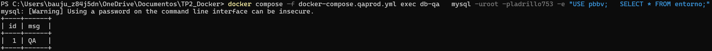
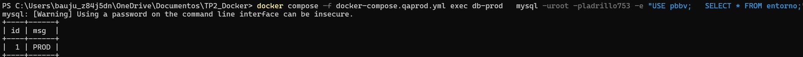

# TP2: Docker 2025

# 1. Elección de Aplicación

> **App elegida:** mi proyecto de Arquitectura de Software1 que se encuentra en <https://github.com/baujuncos/ProyectoArquiSoft1.git>
>
> **Repo:** <https://github.com/baujuncos/TP2_Docker_IS3.git> (clone mi proyecto localmente y lo pushee a un nuevo repositorio remoto creado en Github).

**La app está compuesta por:**
-   Frontend: Aplicación SPA desarrollada en React (sirve interfaz de usuario).
-   Backend: APIs desarrolladas Go que exponen endpoints para las operaciones de negocio.
-   Base de datos: MySQL 5.7 para persistencia de datos.

**Elegí esta aplicación porque:**

-   Es un proyecto real que ya había desarrollado, lo que me permite enfocarme en la containerización en lugar de crear lógica desde cero.

-   Representa un escenario completo (front + back + DB) ideal para practicar conceptos de orquestación con Docker Compose.

-   La separación de responsabilidades (tres servicios distintos) me permite demostrar red interna de contenedores, persistencia de datos, uso de variables de entorno y configuración diferenciada para QA y PROD.

**Configuración del entorno Docker**

1.  Me aseguré de contar con Docker Desktop en mi computadora y verifiqué esto con:
> docker \--version
>
> docker compose version

2.  Hice docker login.

3.  Configuré la carpeta compartida en Docker Desktop (Settings → Resources → File sharing) para permitir el uso de volúmenes persistentes.

4.  Probé contenedores básicos usando lo siguiente y con esto validé que el daemon está activo y que puedo correr contenedores:

> docker run hello-world
> 
> docker run busybox echo \"Docker funcionando correctamente\"

**La configuración de este entorno Docker me permite:**

-   <ins>Desarrollar y probar de forma aislada</ins>: al usar contenedores, evito conflictos de versiones de MySQL, Node o .NET en mi máquina local.

-   <ins>Reproducibilidad</ins>: cualquier compañero o corrector puede clonar el repo y levantar el mismo entorno con docker compose up -d.

-   <ins>Escalabilidad para el TP2</ins>: puedo agregar QA y PROD fácilmente con las mismas imágenes, simplemente cambiando variables de entorno.

> En resumen, la combinación de esta aplicación + Docker Compose me permite demostrar todos los conceptos que el TP2 exige: construcción de imágenes personalizadas, publicación en Docker Hub, integración de base de datos, orquestación de múltiples servicios, configuración de entornos y persistencia de datos.

# 2. Construir una imagen personalizada

## Estructura de Dockerfiles: 
Los Dockerfiles ya estaban creados en el proyecto original (uno para backend y otro para frontend). Se decidió mantenerlos tal cual para preservar compatibilidad con la versión del código usada el año pasado y porque ya demostraron funcionar hoy en mi entorno.

***Dockerfile del Backend (Go): Justificación de Imagen Base.***

<ins>golang:1.18 (etapa builder):</ins>

-   Incluye Go 1.18 preinstalado con todas las herramientas necesarias.
-   Basada en Debian, proporciona un entorno estable para compilación.
-   Incluye git, certificados CA y dependencias del sistema necesarias para go mod.

<ins>ubuntu:latest (etapa runtime):</ins>

-   Sistema operativo familiar y bien documentado.
-   Amplio soporte de paquetes através de apt.
-   Buena compatibilidad con herramientas externas como wait-for-it.sh
-   Suficientes herramientas del sistema para debugging si es necesario.

<ins>Explicación de Instrucciones</ins>

1.  Multi-stage build: Separa la compilación de la ejecución para reducir el tamaño final.

2.  FROM golang:1.18 AS builder: Etapa para compilar el código Go.

3.  WORKDIR /app: Establece el directorio de trabajo dentro del contenedor.

4.  COPY . . Copia todo el código fuente al contenedor.

5.  RUN go mod download: Descarga las dependencias del proyecto.

6.  RUN go build -o main . Compila el código Go en un binario llamado \"main\".

7.  FROM ubuntu:latest: Inicia la etapa de runtime con Ubuntu^.

8.  COPY \--from=builder /app/main . Copia solo el binario compilado desde la etapa anterior.

9.  RUN apt-get update && apt-get install -y ca-certificates && apt-get clean: Instala certificados para conexiones HTTPS y limpia cache.

10. ADD wait-for-it.sh: Descarga herramienta para esperar servicios dependientes.

11. RUN chmod +x: Da permisos de ejecución al script.

12. CMD: Ejecuta wait-for-it para esperar MySQL y luego inicia la aplicación.

<ins>Estructura del Dockerfile</ins>

La estructura sigue el patrón multi-stage que es una mejor práctica:

-   Etapa 1: Ambiente completo de desarrollo para compilar.

-   Etapa 2: Ambiente mínimo de runtime solo con lo necesario para ejecutar.

***Dockerfile del Frontend (React/Node): Justificación de Imagen Base.***

<ins>node:16 (etapa builder):</ins>

-   Incluye Node.js 16 y npm preinstalados.

-   Versión estable y ampliamente utilizada en el momento de Go 1.18.

-   Incluye herramientas necesarias para build de aplicaciones JavaScript/TypeScript.

-   Python y herramientas de compilación disponibles para dependencias nativas.

<ins>nginx:alpine (etapa runtime):</ins>

-   Nginx es el servidor web estándar para servir aplicaciones SPA (Single Page Applications).

-   Alpine Linux mantiene la imagen pequeña (\~23MB vs \~130MB de nginx:latest).

-   Nginx maneja eficientemente archivos estáticos (HTML, CSS, JS).

-   Configuración por defecto adecuada para la mayoría de SPAs.

<ins>Explicación de Instrucciones</ins>

1.  FROM node:16 AS builder: Etapa para construir la aplicación frontend.

2.  WORKDIR /app: Establece directorio de trabajo.

3.  COPY . . Copia todo el código fuente de la aplicación.

4.  RUN npm install: Instala todas las dependencias del package.json.

5.  RUN npm run build: Ejecuta el script de build que genera archivos optimizados para producción.

6.  FROM nginx:alpine: Inicia etapa de runtime con servidor web ligero.

7.  COPY \--from=builder /app/build: Copia archivos construidos al directorio de nginx.

8.  EXPOSE 80: Expone puerto estándar HTTP.

9.  CMD \[\"nginx\", \"-g\", \"daemon off;\"\]: Inicia nginx en foreground (necesario para contenedores).

<ins>Estructura del Dockerfile</ins>

Sigue también el patrón multi-stage:

-   Etapa 1: Instala dependencias y construye la aplicación (genera archivos estáticos).

-   Etapa 2: Sirve únicamente los archivos estáticos construidos mediante nginx.

***¿Por qué esta Estructura?***

Ventajas del Multi-stage Build:

-   Tamaño optimizado: La imagen final no incluye herramientas de
    desarrollo

-   Seguridad: Reduce superficie de ataque eliminando dependencias
    innecesarias

-   Eficiencia: Solo se incluyen los artefactos necesarios para
    ejecución

-   Separación clara: Build-time vs Run-time environments

## **2.1 Construir tags de manera local**

### ¿Qué es un tag en Docker? 

Es como la "versión" de mi imagen.

<ins>Ejemplo</ins>:

> baujuncos/tp2-backend:dev
>
> baujuncos/tp2-backend:v1.0

-   baujuncos → mi usuario en Docker Hub

-   tp2-backend → nombre del repo de imagen

-   dev / v1.0 → tag (etiqueta)

-   Si no pongo tag, Docker usa ":latest" por defecto.

### Construir imágenes con el tag correcto:

1. Paso A -- Backend 
   1. Desde la raíz de mi repo: 
   >docker build -t baujuncos/tp2-backend:dev ./backend
   
2. Paso B -- Frontend
   1. Desde la raíz de mi repo: 
   >docker build -t baujuncos/tp2-frontend:dev ./frontend

Esto genera dos imágenes locales con el tag :dev.

### Confirmamos usando: 
>docker images

-   Salida esperada (y lograda):

| REPOSITORY             | IMAGE | ID          | CREATED       | SIZE  |
|------------------------|-------|-------------|---------------|-------|
| baujuncos/tp2-backend  | dev   | abc1234\... | 2 minutes ago | 215MB |
| baujuncos/tp2-frontend | dev   | def5678\... | 2 minutes ago | 130MB |

## **2.2 Creación de tag de versión estable**

### Creo un nuevo tag basado en la misma imagen sin reconstruir nada:

> docker tag baujuncos/tp2-backend:dev baujuncos/tp2-backend:v1.0
> 
> docker tag baujuncos/tp2-frontend:dev baujuncos/tp2-frontend:v1.0

### Verifico que existen los dos tags y veo que el mismo IMAGE ID ahora tiene dos tags (dev y v1.0):

> docker images

## 3.  **Publicar la imagen en Docker Hub**

### Iniciar sesión por si no lo hice antes con:
> docker login.

### Subir (push) a Docker Hub: esto envía las capas a Docker Hub, es decir, las imágenes quedan públicas en mi cuenta.

> docker push baujuncos/tp2-backend:dev
>
> docker push baujuncos/tp2-frontend:dev
>
> docker push baujuncos/tp2-backend:v1.0
>
> docker push baujuncos/tp2-frontend:v1.0

### Pruebo que están en Docker Hub borradolas localmente y bajandolas otra vez para verificar (Si las baja sin errores están publicadas):

> docker rmi baujuncos/tp2-backend:dev
>
> docker rmi baujuncos/tp2-backend:v1.0
>
> docker pull baujuncos/tp2-backend:dev
>
> docker pull baujuncos/tp2-backend:v1.0

### Usar imágenes en mi docker-compose.yml: una vez que tengo v1.0, puedo cambiar el compose para que use esa versión estable

> backend:
>
>     build:
>
>       context: ./backend
>
>     image: baujuncos/tp2-backend:v1.0

> frontend:
>
>       build:
>
>           context: ./frontend
>
>       image: baujuncos/tp2-frontend:v1.0
>

De esta manera, cualquier persona que haga docker compose up -d descargará mi imagen exacta de Docker Hub.

## Estrategia de versionado de imágenes

Adopté una estrategia de versionado basada en dos tipos de tags: un tag mutable de desarrollo y un tag inmutable para releases.

-   Tag :dev

    -   Se usa para construir y probar iteraciones rápidas durante el desarrollo.

    -   Puede actualizarse muchas veces (con \`docker build\` + \`docker push\`), por lo que siempre apunta a la versión más reciente en progreso.

    -   Facilita que otros desarrolladores o el propio CI/CD obtengan la última versión sin necesidad de cambiar el nombre de la imagen.

-   Tag :v1.0

    -   Representa una versión estable y congelada de la aplicación, que corresponde a la entrega final del TP.

    -   Una vez publicado en Docker Hub, este tag no se sobrescribe: garantiza que cualquier persona pueda reproducir exactamente la versión que se entregó.

    -   Uso de formato SemVer simplificado (\`vMAJOR.MINOR\`), que permite futuras versiones (v1.1, v2.0) si se agregan features o se corrigen bugs.

<ins>Ventajas de esta estrategia</ins>

-   Reproducibilidad: el corrector o cualquier integrante del equipo puede levantar la versión estable usando v1.0 y obtener siempre la misma imagen.

-   Iteración rápida: el equipo puede seguir desarrollando y probando con :dev sin afectar la release ya entregada.

-   Compatibilidad con CI/CD en pipelines automáticos se puede usar :dev para entornos de staging y :vX.Y para producción.

-   Escalabilidad: si en el futuro se libera una nueva versión, simplemente se crea v1.1 o v2.0 y se actualiza el docker-compose.yml a esa versión.

En resumen, la convención permite diferenciar entornos (dev vs prod), mantener trazabilidad de la entrega y seguir evolucionando el proyecto sin romper lo que ya se entregó.

# 4. Integrar una base de datos en contenedor: elección, setup y persistencia.

<ins>Elección</ins>
MySQL 5.7: es la que usa la app original (drivers/ORM compatibles).Imagen oficial estable y bien documentada. Evita cambios de código y me permite enfocarme en containerización y orquestación.

## 4.1 Configuración en docker-compose.yml

-   **Servicio**: db con imagen mysql:5.7.

-   **Credenciales**: MYSQL_ROOT_PASSWORD=ladrillo753.

-   **Base inicial**: MYSQL_DATABASE=pbbv.

-   **Puertos**: 3306:3306

-   **Persistencia**: volumen mysqldata:/var/lib/mysql (los datos sobreviven a down/up de contenedores).

-   **Healthcheck**: para que Docker sepa si un contenedor está funcionando correctamente y listo para aceptar conexiones. En este caso, verificamos si un contenedor que ejecuta un servidor MySQL está vivo y respondiendo a comandos.

## 4.2 Conexión de la app (backend → DB)
El backend usa nombre de servicio en la red de Docker (no localhost):

-   DB_HOST=db

-   DB_PORT=3306 (puerto interno del contenedor)

-   DB_USER=root

-   DB_PASSWORD=ladrillo753

-   DB_NAME=pbbv

<ins>Ventaja</ins>: puedo correr la misma imagen en QA/PROD cambiando solo DB_NAME, credenciales o flags por variables de entorno.

## 4.3 Verificaciones y persistencia.

### Levantamos:

> docker compose up -d \--build

### Verificamos:

> docker compose ps

### Verificamos que la DB esté arriba:

> docker compose logs -f db

### Vemos DB y creamos dato de prueba (exitosamente):

> docker compose exec db mysql -uroot -pladrillo753 -e "SHOW DATABASES;"
>
> docker compose exec db mysql -uroot -pladrillo753 -e "USE pbbv; CREATE TABLE IF NOT EXISTS test (id INT AUTO_INCREMENT PRIMARY KEY, msg VARCHAR(50)); INSERT INTO test (msg) VALUES ('ok'); SELECT * FROM test;"

### Prueba de persistencia (exitosa):

>docker compose down ---> Detiene y elimina los contenedores, redes y volúmenes
>
> docker compose up -d  ---> Crea y arranca todos los servicios definidos en docker-compose.yml en segundo plano (-d de \"detached\")
>
> docker compose exec db mysql -uroot -pladrillo753 -e "USE pbbv; SELECT * FROM test;"

# 5. Configurar QA y PROD con la misma imagen.

## Contenedores de QA (Aseguramiento de Calidad)
> Los contenedores de QA se utilizan para **probar y validar** una
> aplicación antes de que se lance. Son una réplica del entorno de
> producción, lo que permite al equipo de control de calidad (QA)
> asegurarse de que el software funciona como se espera, sin afectar a
> los usuarios en vivo.

<ins>Características principales:</ins>

-   Aislamiento: Permiten probar nuevas funcionalidades en un entorno aislado, lo que evita que los errores de código lleguen a la versión en producción.

-   Pruebas exhaustivas: Son el lugar ideal para realizar pruebas de regresión, pruebas de rendimiento y pruebas de integración.

## Contenedores de PROD (Producción)

> Los contenedores de PROD son los que se utilizan para la **aplicación
> en vivo** a la que acceden los usuarios finales. Estos contenedores
> están en un entorno completamente estable y seguro, y se construyen
> con la máxima optimización de recursos y rendimiento.

<ins>Características principales:</ins>

-   Acceso público: Están expuestos a internet, por lo que deben ser altamente seguros y fiables.

-   Escalabilidad: Se pueden escalar fácilmente para manejar el aumento de tráfico de usuarios.

-   Persistencia de datos: Suelen estar conectados a bases de datos y volúmenes persistentes para garantizar que los datos de la aplicación no se pierdan.

## 5.1 Cambios en docker-compose.yml

### <ins>Objetivo</ins>: dos contenedores de backend que usen la misma imagen pero con variables de entorno distintas.

-   Dos bases de datos separadas (aislamiento QA/PROD)
    -   Antes (compose común): un único servicio db con una base (pbbv) y un solo volumen.

    -   Ahora: dos servicios de DB, db-qa y db-prod, cada uno con su propio volumen (mysqldata-qa, mysqldata-prod) → datos totalmente separados.

    -   Beneficio: ambientes aislados, reproducibles y comparables (QA y PROD "parten iguales" pero no se pisan datos).

-   Dos backends con la misma imagen (requisito)

    -   Antes: un solo backend.
    -   Ahora: backend-qa y backend-prod:
        -   Ambos usan la misma imagen baujuncos/tp2-backend:v1.0 (y dejé build: ./backend para seguir iterando localmente si quiero).

        -   Cambian solo las variables de entorno:
            -   Conexión: DB_HOST=db-qa/db-prod, DB_PORT=3306, DB_NAME=pbbv, DB_USER, DB_PASSWORD.

            -   DB_DSN armado explícitamente (útil si la app lo usa directo).

            -   Distinción de entorno: APP_ENV=QA vs APP_ENV=PROD.

            -   Logging: LOG_LEVEL=debug en QA vs LOG_LEVEL=info en PROD (PROD más silencioso).

    -   **Beneficio:** una **única build** sirve para múltiples
        entornos; las diferencias de comportamiento se manejan con **env
        vars** (12-factor), no recompilando.

## 5.2 ¿Cómo levantar y probar?

### Levantar QA + PROD con sus DBs dedicadas:
>docker compose -f docker-compose.qaprod.yml up -d

### Ver estado:
>docker compose -f docker-compose.qaprod.yml ps

### Logs puntuales:
>docker compose -f docker-compose.qaprod.yml logs -f db-qa
> 
>docker compose -f docker-compose.qaprod.yml logs -f db-prod
> 
>docker compose -f docker-compose.qaprod.yml logs -f backend-qa
> 
> docker compose -f docker-compose.qaprod.yml logs -f backend-prod

## 5.3 Prueba de aislamiento de bases de datos.**

### QA: tablas
> docker compose -f docker-compose.qaprod.yml exec db-qa mysql -uroot -pladrillo753 -e "USE pbbv; SHOW TABLES;"

### PROD: tablas (deben coincidir con QA)
>   docker compose -f docker-compose.qaprod.yml exec db-prod mysql
    -uroot -pladrillo753 -e \"USE pbbv; SHOW TABLES;\"

### Insertar datos distintos para confirmar separación:

> docker compose -f docker-compose.qaprod.yml exec db-qa mysql -uroot -pladrillo753 -e "USE pbbv; CREATE TABLE IF NOT EXISTS entorno (id INT AUTO_INCREMENT PRIMARY KEY, msg VARCHAR(50)); INSERT INTO entorno (msg) VALUES ('QA'); SELECT * FROM entorno;"
>
> docker compose -f docker-compose.qaprod.yml exec db-prod mysql -uroot -pladrillo753 -e "USE pbbv; CREATE TABLE IF NOT EXISTS entorno (id INT AUTO_INCREMENT PRIMARY KEY, msg VARCHAR(50)); INSERT INTO entorno (msg) VALUES ('PROD'); SELECT * FROM entorno;"

### Corroboramos que ambos backends funcionan correctamente con consultas curl

## 5.4 Ventajas

-   **Aislamiento total** entre QA/PROD (datos, rendimiento,
    mantenimiento).

-   **Observabilidad**: LOG_LEVEL distinto permite depurar en QA sin
    "ensuciar" PROD.

-   **Portabilidad**: se cambian solo envs/puertos; la imagen es la
    misma.

# 6. Preparar entorno reproducible con docker-compose.

<ins>Objetivos</ins>:
-   **Mismas imágenes** para todos (tags fijos v1.0).

-   **Variables** fuera del YAML (en .env).

-   **Dos DBs** separadas (QA y PROD).

-   **Volúmenes nombrados** para persistencia (no dependen del host).

-   **Healthchecks** y depends_on para orden de arranque.

- Para hacer esto creamos un docker-compose.reproducible.yml aparte del resto de compose para diferenciar de las últimas pruebas y ejercicios hechos en otros archivos docker-compose.

## Las variables de entorno a utilizar son...

> \# .env.example
>
> PROJECT_PREFIX=tp2
>
>
> \# Zona horaria
>
> TZ=America/Argentina/Cordoba
>
>
> \# MySQL
>
> MYSQL_ROOT_PASSWORD=ladrillo753
>
> MYSQL_USER=root
>
> MYSQL_DB_NAME_QA=pbbv
>
> MYSQL_DB_NAME_PROD=pbbv
>
> \# Puertos host (cambiables si están ocupados)
>
> DB_QA_HOST_PORT=3307
>
> DB_PROD_HOST_PORT=3308
>
> BACKEND_QA_HOST_PORT=8081
>
> BACKEND_PROD_HOST_PORT=8080
>
> FRONTEND_HOST_PORT=80
>

## Reproducibilidad

-   **Tags fijos**: todas las imágenes con **tag de versión** (v1.0), no
    latest.

-   **docker compose pull** antes de up para asegurar mismas capas.

-   **Variables centralizadas** en .env: mismos nombres de servicio,
    puertos, credenciales.

-   **Volúmenes nombrados**: no dependen de rutas host.

-   **Healthchecks** + depends_on: orden de arranque consistente.

> **Accesos por defecto**

-   **Frontend (QA)**: <http://localhost>

-   **Backend QA**: <http://localhost:8081>

-   **Backend PROD**: <http://localhost:8080>

-   **DB QA (host)**: 127.0.0.1:3307 (root / MYSQL_ROOT_PASSWORD)

-   **DB PROD (host)**:127.0.0.1:3308
